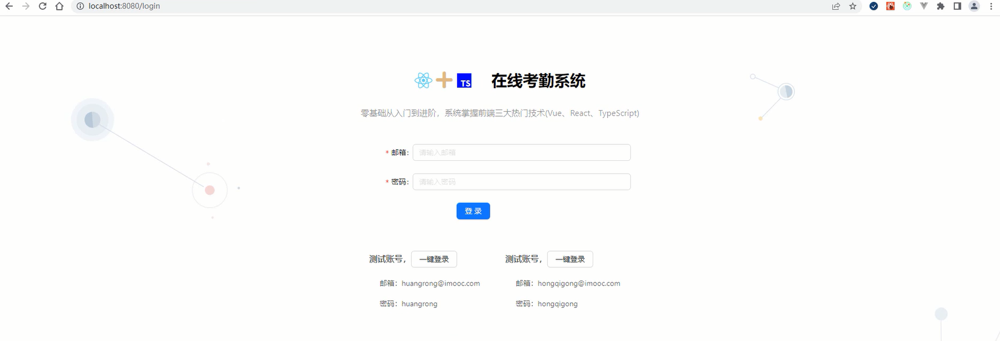

# 搭建登录界面及iconfont图标使用

## 登录页布局

第一步编写登录页的布局。

```tsx
// views/Login.tsx
export default function Login() {
    ...
    return (
        <div className={styles.login}>
            <div className={styles.header}>
                <span className={styles['header-logo']}>
                    <i className={classNames('iconfont icon-react', styles['icon-react'])}></i>
                    <i className={classNames('iconfont icon-icon-test', styles['icon-icon-test'])}></i>
                    <i className={classNames('iconfont icon-typescript', styles['icon-typescript'])}></i>
                </span>
                <span className={styles['header-title']}>在线考勤系统</span>
            </div>
            <div className={styles.desc}>
                零基础从入门到进阶，系统掌握前端三大热门技术(Vue、React、TypeScript)
            </div>
            <Form
                name="basic"
                labelCol={{ span: 6 }}
                wrapperCol={{ span: 18 }}
                initialValues={{ remember: true }}
                onFinish={onFinish}
                onFinishFailed={onFinishFailed}
                autoComplete="off"
                className={styles.main}
                form={form}
                >
                <Form.Item
                    label="邮箱"
                    name="email"
                    rules={[
                        { required: true, message: '请输入邮箱' },
                        { type: 'email', message: '请输入正确的邮箱地址' }
                    ]}
                    >
                    <Input placeholder="请输入邮箱" />
                </Form.Item>

                <Form.Item
                    label="密码"
                    name="pass"
                    rules={[{ required: true, message: '请输入密码' }]}
                    >
                    <Input.Password placeholder="请输入密码" visibilityToggle={false} />
                </Form.Item>
                <Form.Item wrapperCol={{ offset: 6, span: 18 }}>
                    <Button type="primary" htmlType="submit">
                        登录
                    </Button>
                </Form.Item>
            </Form>
            <div className={styles.users}>
                <Row gutter={20}>
                    {
                        testUsers.map((v)=> (
                            <Col key={v.email} span={12}>
                                <h3>
                                    测试账号，<Button onClick={autoLogin({email: v.email, pass: v.pass})}>一键登录</Button>
                                </h3>
                                <p>邮箱：{v.email}</p>
                                <p>密码：{v.pass}</p>
                            </Col>
                        ))
                    }
                </Row>
            </div>
        </div>
    )
}
```

结构当中主要用到了atnd框架的`<Form>`组件和`<Form.Item>`组件。

第二步就是编写登录组件的样式。

```scss
// /views/Login.module.scss
.login {
  width: 100vw;
  height: 100vh;
  background: url('../../assets/images/login-bg.svg') no-repeat center 110px;
  background-size: 100%;
  .header {
    height: 44px;
    line-height: 44px;
    display: flex;
    justify-content: center;
    align-items: center;
    font-size: 34px;
    padding-top: 100px;
    .header-logo {
      .icon-react,
      .icon-icon-test,
      .icon-typescript {
        margin-right: 5px;
        font-size: inherit;
      }
      .icon-react {
        color: #61dafb;
      }
      .icon-icon-test {
        color: #deb887;
      }
      .icon-typescript {
        color: blue;
      }
    }
    .header-title {
      margin-left: 30px;
      font-weight: 700;
      font-size: 30px;
    }
  }
  .desc {
    text-align: center;
    padding-top: 30px;
    color: rgba(0, 0, 0, 0.45);
    font-size: 16px;
  }
  .main {
    width: 500px;
    margin: 0 auto;
    padding-top: 50px;
  }
  .users{
    width: 500px;
    margin: 60px auto;
    color: rgba(0,0,0,.65);
    h3{
      font-size: 16px;
    }
    p{
      margin: 20px;
    }
  }
}
```

样式中用到了iconfont图标。

<div align=center>
    
    <div>登录页布局</div>
</div>
