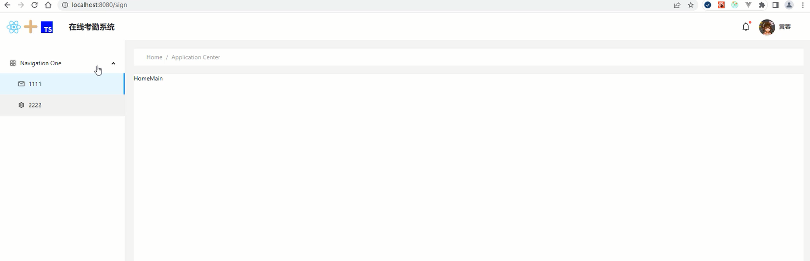

# 拆分首页导航组件和主体区域组件

<HomeBreadcrumb>组件的布局和样式。

```tsx
import React from 'react'
import styles from '../Home.module.scss'
import { Breadcrumb } from 'antd'
export default function HomeBreadcrumb() {
  return (
    <Breadcrumb className={styles['home-breadcrumb']}>
      <Breadcrumb.Item>Home</Breadcrumb.Item>
      <Breadcrumb.Item>Application Center</Breadcrumb.Item>
    </Breadcrumb>
  )
}
```

```scss
.home-breadcrumb {
  background: #fff;
  height: 40px;
  display: flex;
  align-items: center;
  padding-left: 30px;
}
```

<HomeMain>组件的布局和样式。

```tsx
import React, { Suspense } from 'react'
import { Outlet } from 'react-router-dom'
export default function HomeMain() {
  return (
    <div>
      <Suspense>
        <Outlet />
      </Suspense>
    </div>
  ) 
}
```

<div align=center>
    
    <div>首页布局</div>
</div>
