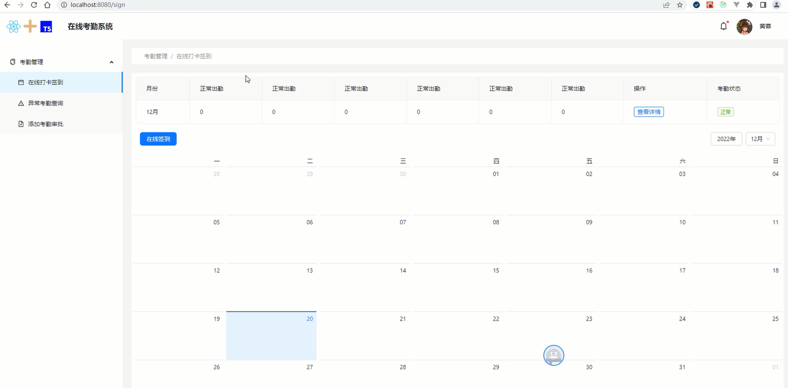

# 打卡签到页描述列表和日历布局

## 完成签到页布局

签到页主要用到描述列表组件和日历组件。

描述列表组件采用antd中的<Descriptions>组件；而日历组件采用antd中的<Calendar>组件。

```tsx
// /views/Sign/Sign.tsx
import React, { useState, useEffect } from 'react'
import styles from './Sign.module.scss'
import {
    Descriptions,
    Button,
    Tag,
    Calendar,
    Row,
    Space,
    Select,
    message,
} from 'antd'
import 'dayjs/locale/zh-cn'
import locale from 'antd/es/date-picker/locale/zh_CN'
import type { Dayjs } from 'dayjs

export default function Sign() {
    const [month, setMonth] = useState(date.getMonth())
    return (
        <div>
            <Descriptions
                className={styles.descriptions}
                layout="vertical"
                column={9}
                bordered
                >
                <Descriptions.Item label="月份">{month+1}月</Descriptions.Item>
                <Descriptions.Item label="正常出勤">0</Descriptions.Item>
                <Descriptions.Item label="正常出勤">0</Descriptions.Item>
                <Descriptions.Item label="正常出勤">0</Descriptions.Item>
                <Descriptions.Item label="正常出勤">0</Descriptions.Item>
                <Descriptions.Item label="正常出勤">0</Descriptions.Item>
                <Descriptions.Item label="正常出勤">0</Descriptions.Item>
                <Descriptions.Item label="操作">
                    <Button type="primary" ghost size="small">
                        查看详情
                    </Button>
                </Descriptions.Item>
                <Descriptions.Item label="考勤状态">
                    <Tag>正常</Tag>
                </Descriptions.Item>
            </Descriptions>
            <Calendar
                locale={locale}
                headerRender={({ value, type, onChange, onTypeChange }) => {
                    const monthOptions = []
                    for (let i = 0; i < 12; i++) {
                        monthOptions.push(
                            <Select.Option key={i} value={i}>
                                {i + 1}月
                            </Select.Option>
                        )
                    }
                    return (
                        <Row
                            className={styles['calendar-header']}
                            justify="space-between"
                            align="middle"
                            >
                            <Button type="primary" onClick={handlePutTime}>
                                在线签到
                            </Button>
                            <Space>
                                <Button>2022年</Button>
                                <Select value={month}>
                                    {monthOptions}
                                </Select>
                            </Space>
                        </Row>
                    )
                }}
                />
        </div>
    )
}
```

这里对日历的头部做了自定义处理，利用日历组件的headerRender属性。

这里对日历进行了中文显示，利用日历组件的locale属性。

下面是签到页布局的样式。

```scss
// /views/Sign/Sign.module.scss
.descriptions{
  margin: 10px;
}
.calendar-header{
  margin: 20px;
}
```

<div align=center>
    
    <div>签到页布局</div>
</div>
