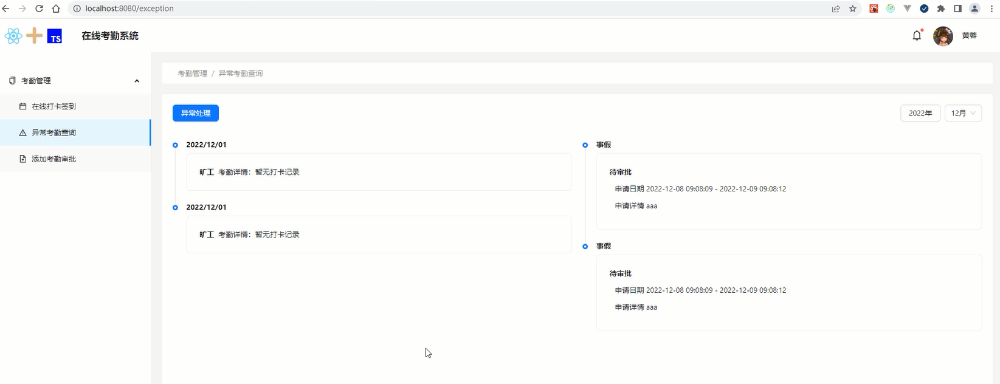

# 异常考勤页时间线布局

## 异常考勤页布局

主要用到`<Timeline>`和`<Empty>`这两个组件。

```tsx
// /views/Exception/Exception.tsx
import React, { useState, useEffect } from 'react'
import styles from './Exception.module.scss'
import { Row, Col, Button, Select, Space, Empty, Timeline, Card } from 'antd'

export default function Exception() {
   	...
    return (
        <div className={styles.exception}>
            <Row justify="space-between" align="middle">
                <Link to="/apply">
                    <Button type="primary">异常处理</Button>
                </Link>
                <Space>
                    <Button>{year}年</Button>
                    <Select value={month} onChange={handleChange}>
                        {monthOptions}
                    </Select>
                </Space>
            </Row>
            <Row className={styles['exception-line']} gutter={20}>
               <Col span={12}>
                    {/* <Empty description="暂无申请审批" imageStyle={{height: 200}} /> */}
                    <Timeline>
                        <Timeline.Item>
                            <h3>2022/12/01</h3>
                            <Card className={styles['exception-card']}>
                                <Space>
                                    <h4>旷工</h4>
                                    <p>考勤详情：暂无打卡记录</p>
                                </Space>
                            </Card>
                        </Timeline.Item>
                        <Timeline.Item>
                            <h3>2022/12/01</h3>
                            <Card className={styles['exception-card']}>
                                <Space>
                                    <h4>旷工</h4>
                                    <p>考勤详情：暂无打卡记录</p>
                                </Space>
                            </Card>
                        </Timeline.Item>
                   </Timeline>
                </Col>
                <Col span={12}>
                    {/* <Empty description="暂无申请审批" imageStyle={{height: 200}} /> */}
                    <Timeline>
                        <Timeline.Item>
                            <h3>事假</h3>
                            <Card className={styles['exception-card']}>
                                <h4>待审批</h4>
                                <p className={styles['exception-content']}>申请日期 2022-12-08 09:08:09 - 2022-12-09 09:08:12</p>
                                <p className={styles['exception-content']}>申请详情 aaa</p>
                            </Card>
                        </Timeline.Item>
                        <Timeline.Item>
                            <h3>事假</h3>
                            <Card className={styles['exception-card']}>
                                <h4>待审批</h4>
                                <p className={styles['exception-content']}>申请日期 2022-12-08 09:08:09 - 2022-12-09 09:08:12</p>
                                <p className={styles['exception-content']}>申请详情 aaa</p>
                            </Card>
                        </Timeline.Item>
                    </Timeline>
                </Col>
            </Row>
        </div>
    )
}
```

异常考勤页样式。

```scss
.exception{
    margin: 20px;
}
.exception-line{
    margin-top: 40px;
}
.exception-card{
    margin-top: 5px;
}
.exception-content{
    margin: 10px;
}
```

<div align=center>
    
    <div>异常考勤页布局</div>
</div>


