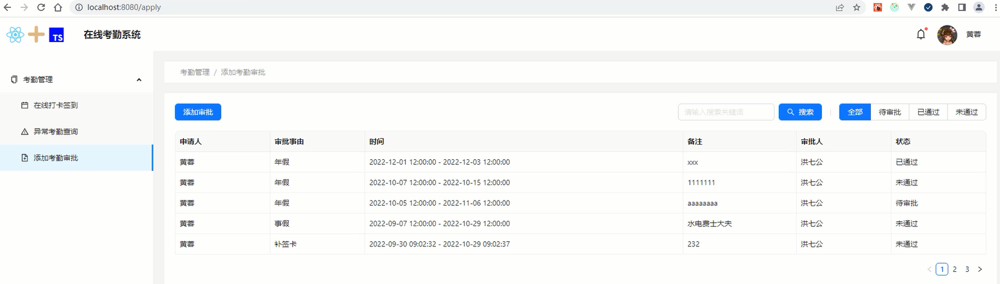

# 分页处理与筛选功能实现

## 审批页状态管理

关于审批相关的数据，都是在`/store/modules/checks.ts`这个页中进行完成。

```tsx
// /store/modules/checks.ts
import http from '../../utils/http';
import { createSlice, createAsyncThunk } from '@reduxjs/toolkit'
import type { PayloadAction } from '@reduxjs/toolkit'
export type Infos = {
  [index: string]: unknown
}
type ChecksState = {
  applyList: Infos[]
  checkList: Infos[]
}
type GetApply = {
  applicantid?: string
  approverid?: string
}
type PostApply = {
  applicantid: string
  applicantname: string
  approverid: string
  approvername: string
  note: string
  reason: string
  time: [string, string]
}
type PutApply = {
  _id: string 
  state: '已通过' | '未通过'
}
export const getApplyAction = createAsyncThunk('checks/getApplyAction', async (payload: GetApply) => {
  const ret = await http.get('/checks/apply', payload)
  return ret;
})
export const postApplyAction = createAsyncThunk('checks/postApplyAction', async (payload: PostApply)=>{
  const ret = await http.post('/checks/apply', payload)
  return ret; 
})
export const putApplyAction = createAsyncThunk('checks/putApplyAction', async (payload: PutApply)=>{
  const ret = await http.put('/checks/apply', payload)
  return ret; 
})
const checksSlice = createSlice({
  name: 'checks',
  initialState: {
    applyList: [],
    checkList: []
  } as ChecksState,
  reducers: {
    updateApplyList(state, action: PayloadAction<Infos[]>){
      state.applyList = action.payload;
    },
    updateCheckList(state, action: PayloadAction<Infos[]>){
      state.checkList = action.payload;
    }
  }
})
export const { updateApplyList, updateCheckList } = checksSlice.actions;
export default checksSlice.reducer;
```

对于添加审批页来说，主要用到了`getApplyAction`和`updateApplyList`这两个方法。

```tsx
// /views/Apply/Apply.tsx
import React, { useState, useEffect } from 'react'
import styles from './Apply.module.scss'
import { Row, Button, Space, Input, Divider, Radio, Table, Modal, Form, Select, DatePicker, message } from 'antd'
import type { RadioChangeEvent } from 'antd'
import { SearchOutlined } from '@ant-design/icons'
import type { ColumnsType } from 'antd/es/table'
import type { Infos } from '../../store/modules/checks'
import { useSelector } from 'react-redux'
import { useAppDispatch } from '../../store'
import type { RootState } from '../../store'
import _ from 'lodash'
import { getApplyAction, updateApplyList } from '../../store/modules/checks'

const approverTypes = [
  {label: '全部', value: '全部'},
  {label: '待审批', value: '待审批'},
  {label: '已通过', value: '已通过'},
  {label: '未通过', value: '未通过'}
];
const defaultType = approverTypes[0].value;
const columns: ColumnsType<Infos> = [
  {
    title: '申请人',
    dataIndex: 'applicantname',
    key: 'applicantname',
    width: 180
  },
  {
    title: '审批事由',
    dataIndex: 'reason',
    key: 'reason',
    width: 180
  },
  {
    title: '时间',
    dataIndex: 'time',
    key: 'time',
    render(_){
      return _.join(' - ')
    }
  },
  {
    title: '备注',
    dataIndex: 'note',
    key: 'note',
  },
  {
    title: '审批人',
    dataIndex: 'approvername',
    key: 'approvername',
    width: 180
  },
  {
    title: '状态',
    dataIndex: 'state',
    key: 'state',
    width: 180
  }
];

export default function Apply() {
  const [ approverType, setApproverType ] = useState(defaultType)
  const [ searchWord, setSearchWord ] = useState('')
  const [isModalOpen, setIsModalOpen] = useState(false)
  const [form] = Form.useForm()
  const usersInfos = useSelector((state: RootState) => state.users.infos)
  const applyList = useSelector((state: RootState)=> state.checks.applyList).filter((v)=> (v.state === approverType || defaultType === approverType) && (v.note as string).includes(searchWord)) 
  const newsInfo = useSelector((state: RootState)=> state.news.info)
  const dispatch = useAppDispatch()
  useEffect(() => {
    if (_.isEmpty(applyList)) {
      dispatch(getApplyAction({ applicantid: usersInfos._id as string })).then(
        (action) => {
          const { errcode, rets } = (
            action.payload as { [index: string]: unknown }
          ).data as { [index: string]: unknown }
          if (errcode === 0) {
            dispatch(updateApplyList(rets as Infos[]))
          }
        }
      )
    }
  }, [applyList, usersInfos, dispatch])

  const approverTypeChange = (ev: RadioChangeEvent) => {
    setApproverType(ev.target.value)
  }
  const searchWordChange  = (ev: React.ChangeEvent<HTMLInputElement>) => {
    setSearchWord(ev.target.value)
  }
  return (
    <div>
      <Row className={styles['apply-title']} justify="space-between">
        <Button type="primary" onClick={showModal}>添加审批</Button>
        <Space>
          <Input placeholder="请输入搜索关键词" value={searchWord} onChange={searchWordChange} />
          <Button type="primary" icon={<SearchOutlined />}>搜索</Button>
          <Divider style={{ borderLeftColor: '#dcdfe6' }} type="vertical" />
          <Radio.Group
            options={approverTypes}
            optionType="button"
            buttonStyle="solid"
            value={approverType}
            onChange={approverTypeChange}
          />
        </Space>
      </Row>
      <Table rowKey="_id" className={styles['apply-table']} dataSource={applyList} columns={columns} bordered size="small" pagination={{defaultPageSize: 5}} />
    </div>
  )
}
```

在antd中，分页和表格是自动关联好的，通过pagination属性。

<div align=center>
    
    <div>表格数据与分页处理</div>
</div>
