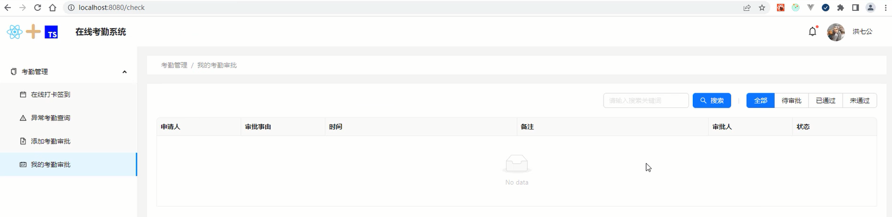

# 我的审批页功能栏与数据表格布局

## 我的审批页布局

完成我的审批页功能栏和表格布局，跟前面做的添加审批页的布局类似。

```tsx
// /views/Check/Check.tsx
import React, { useState, useEffect } from 'react'
import styles from './Check.module.scss'
import { Row, Space, Input, Button, Divider, Radio, Table, message } from 'antd'
import type { RadioChangeEvent } from 'antd'
import { SearchOutlined, CheckOutlined, CloseOutlined } from '@ant-design/icons'
import { useSelector } from 'react-redux'
import { useAppDispatch } from '../../store'
import type { RootState } from '../../store'
import _ from 'lodash'
import type { ColumnsType } from 'antd/es/table'
import type { Infos } from '../../store/modules/checks'
const approverTypes = [
  {label: '全部', value: '全部'},
  {label: '待审批', value: '待审批'},
  {label: '已通过', value: '已通过'},
  {label: '未通过', value: '未通过'}
];
const defaultType = approverTypes[0].value;
export default function Check() {
  const [ approverType, setApproverType ] = useState(defaultType)
  const [ searchWord, setSearchWord ] = useState('')
  const checkList = []
  const columns: ColumnsType<Infos> = [
    {
      title: '申请人',
      dataIndex: 'applicantname',
      key: 'applicantname',
      width: 180
    },
    {
      title: '审批事由',
      dataIndex: 'reason',
      key: 'reason',
      width: 180
    },
    {
      title: '时间',
      dataIndex: 'time',
      key: 'time',
      render(_){
        return _.join(' - ')
      }
    },
    {
      title: '备注',
      dataIndex: 'note',
      key: 'note',
    },
    {
      title: '操作',
      dataIndex: 'handle',
      key: 'handle',
      width: 180
    },
    {
      title: '状态',
      dataIndex: 'state',
      key: 'state',
      width: 180
    }
  ];
  const approverTypeChange = (ev: RadioChangeEvent) => {
    setApproverType(ev.target.value)
  }
  const searchWordChange  = (ev: React.ChangeEvent<HTMLInputElement>) => {
    setSearchWord(ev.target.value)
  }
  return (
    <div>
      <Row className={styles['check-title']} justify="end">
        <Space>
          <Input placeholder="请输入搜索关键词" value={searchWord} onChange={searchWordChange} />
          <Button type="primary" icon={<SearchOutlined />}>搜索</Button>
          <Divider style={{ borderLeftColor: '#dcdfe6' }} type="vertical" />
          <Radio.Group
            options={approverTypes}
            optionType="button"
            buttonStyle="solid"
            value={approverType}
            onChange={approverTypeChange}
          />
        </Space>
      </Row>
      <Table rowKey="_id" className={styles['check-table']} dataSource={checkList} columns={columns} bordered size="small" pagination={{defaultPageSize: 5}} />
    </div>
  )
}
```

我的审批页样式。

```scss
.check-title{
  margin: 20px;
}
.check-table{
  margin: 20px;
}
```

<div align=center>
    
    <div>我的审批页布局</div>
</div>


